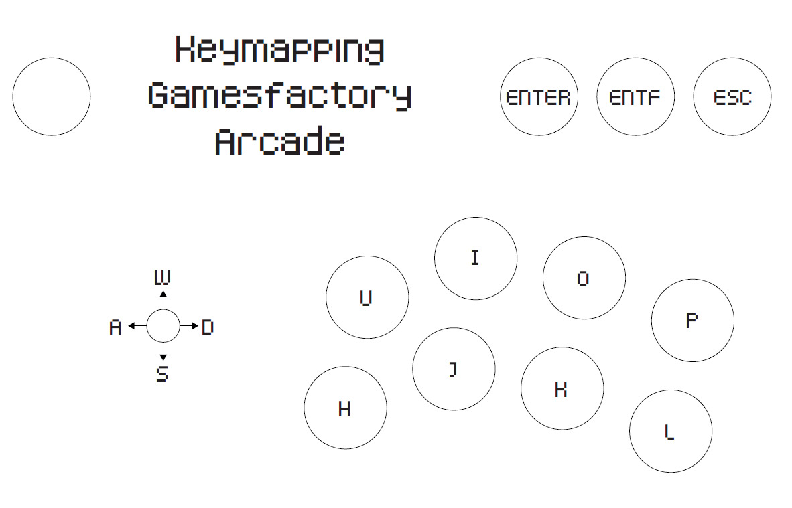

# FrankenGameJam2024
Programm source code for the Franken GameJam 2024

# Game Idea

We have cat, let's call her "Luna". Luna has - such as every other cat - 7 lives. 7 lives, in which she needs to finish curtain challenges to collect 7 postcards. Every life she basically starts at zero and needs to train skills to fullfil all challenges.

# Key Bindings

## Keyboard defaults

| Key | Function |
|-|-|
| W | walk up |
| A | walk left |
| S | walk down |
| D | walk right |
| E | open and close inventory |
| SPACE | interact with objects in the world |
| ESC | Pause game/enter options |

## Arcade mode

In settings, you can switch on Arcade Mode to be able to control the game using the Gamesfactory Arcade Machine

| Key | Function |
|-|-|
| Joystick | walk up, down, left and right |
| U | open and close inventory |
| H | interact with objects in the world |
| ESC | Pause game/enter options |
